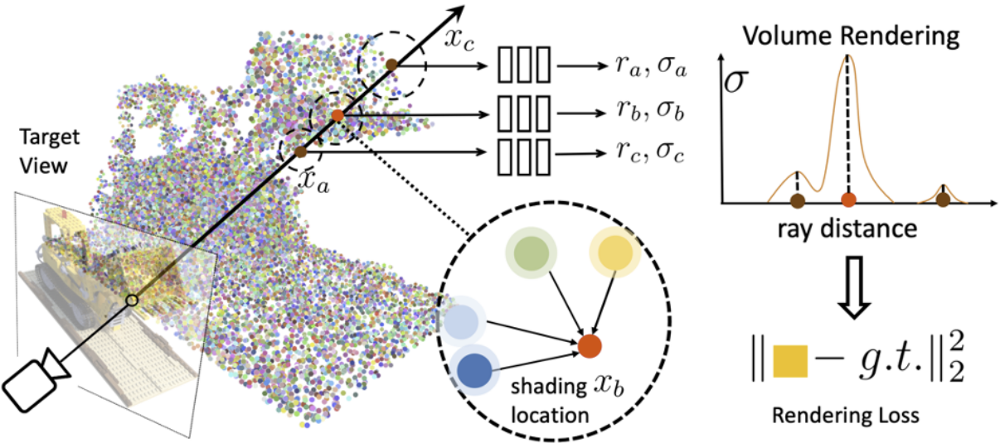

# Point-NeRF: Point-based Neural Radiance Fields (CVPR 2022 Oral 🤩)


[Project Sites](https://xharlie.github.io/projects/project_sites/pointnerf/index.html)
 | [Paper](https://arxiv.org/pdf/2201.08845.pdf) |
Primary contact: [Qiangeng Xu](https://xharlie.github.io/)

Point-NeRF uses neural 3D point clouds, with associated neural features, to model a radiance field. Point-NeRF can be rendered efficiently by aggregating neural point features near scene surfaces, in a ray marching-based rendering pipeline. Moreover, Point-NeRF can be initialized via direct inference of a pre-trained deep network to produce a neural point cloud; this point cloud can be finetuned to surpass the visual quality of NeRF with 30X faster training time. Point-NeRF can be combined with other 3D reconstruction methods and handles the errors and outliers in such methods via a novel pruning and growing mechanism.

<!--  -->

[](https://youtu.be/zmR9j-4AebA)

## Reference
Please cite our paper if you are interested   
 <strong>Point-NeRF: Point-based Neural Radiance Fields</strong>.  &nbsp;&nbsp;&nbsp; 
```
@inproceedings{xu2022point,
  title={Point-nerf: Point-based neural radiance fields},
  author={Xu, Qiangeng and Xu, Zexiang and Philip, Julien and Bi, Sai and Shu, Zhixin and Sunkavalli, Kalyan and Neumann, Ulrich},
  booktitle={Proceedings of the IEEE/CVF Conference on Computer Vision and Pattern Recognition},
  pages={5438--5448},
  year={2022}
}
```
## Overal Instruction
1. Please first install the libraries as below and download/prepare the datasets as instructed.
2. Point Initialization: Download pre-trained MVSNet as below and train the feature extraction from scratch or directly download the pre-trained models. (Obtain 'MVSNet' and 'init' folder in checkpoints folder)
3.  Per-scene Optimization: Download pre-trained models or optimize from scratch as instructed.

For nerfsynthetic, colmap_nerfsynthetic, tanks&temples, scannet and dtu,  
We provide all the checkpoint_files [google drive](https://drive.google.com/drive/folders/1xk1GhDhgPk1MrlX8ncfBz5hNMvSa9vS6?usp=sharing) | [baidu wangpan](https://pan.baidu.com/s/1doJHI03Tgl_qIquGZuW5bw?pwd=p8bs); all the images and scores of the test results [google drive](https://drive.google.com/drive/folders/1KAYs7XuBJNMTHVBuOCtpLNv9P8UMoayw?usp=sharing) | [baidu wangpan](https://pan.baidu.com/s/1BMewWRSIkNFlp7DKYmx9vQ?pwd=3yse); and video results [google drive](https://drive.google.com/drive/folders/1dutZEZO9vfeIbfWwplbIIam7YBeyZ0dY?usp=sharing) | [baidu wangpan](https://pan.baidu.com/s/1kC1qSL5dkT8cDdE3dHTc2A?pwd=j46j);

We also share the visual results of [npbg](https://github.com/alievk/npbg), [nsvf](https://github.com/facebookresearch/NSVF) and [ibrnet](https://github.com/googleinterns/IBRNet) on the Nerf Synthetic dataset generated by our machine [google drive](https://drive.google.com/drive/folders/1KHhljnqLvIJkRkaqQ8TaeBZirMsnDAhf?usp=sharing);  Please cite their papers accordingly if interested.

## Installation

### Requirements
All the codes are tested in the following environment:
* Linux (tested on Ubuntu 16.04, 18.04, 20.04)
* Python 3.6+
* PyTorch 1.7 or higher (tested on PyTorch 1.7, 1.8.1, 1.9, 1.10)
* CUDA 10.2 or higher 

### Install
Install the dependent libraries as follows:

* Install the dependent python libraries:
```
pip install torch==1.8.1+cu102 h5py
pip install imageio scikit-image
```
* Install pycuda (crucial) following:
https://documen.tician.de/pycuda/install.html 
* Install torch_scatter following:
https://github.com/rusty1s/pytorch_scatter

We develope our code with pytorch1.8.1, pycuda2021.1, and torch_scatter 2.0.8

## Data Preparation

The layout should looks like this, we provide all data folder here: [google_drive](https://drive.google.com/drive/folders/1kqbbdbbN1bQnwYglRe4iV8dKnyCvoOFS?usp=sharing)
```
pointnerf
├── data_src
│   ├── dtu
    │   │   │──Cameras
    │   │   │──Depths
    │   │   │──Depths_raw
    │   │   │──Rectified
    ├── nerf
    │   │   │──nerf_synthetic
    │   │   │──nerf_synthetic_colmap
    ├── TanksAndTemple
    ├── scannet
    │   │   │──scans 
    |   │   │   │──scene0101_04
    |   │   │   │──scene0241_01
```
Or you can download using the official links as follows:

## DTU:
Download the preprocessed [DTU training data](https://drive.google.com/file/d/1eDjh-_bxKKnEuz5h-HXS7EDJn59clx6V/view)
and [Depth_raw](https://virutalbuy-public.oss-cn-hangzhou.aliyuncs.com/share/cascade-stereo/CasMVSNet/dtu_data/dtu_train_hr/Depths_raw.zip) from original [MVSNet repo](https://github.com/YoYo000/MVSNet)
and unzip. 


## NeRF Synthetic
Download `nerf_synthetic.zip` from [here](https://drive.google.com/drive/folders/128yBriW1IG_3NJ5Rp7APSTZsJqdJdfc1) under ``data_src/nerf/''


## Tanks & Temples
Follow Neural Sparse Voxel Fields and download [Tanks&Temples](https://www.tanksandtemples.org/) | [download (.zip)](https://dl.fbaipublicfiles.com/nsvf/dataset/TanksAndTemple.zip) | 0_\* (training) 1_\* (testing) as:
``data_src/TanksAndTemple/''

## ScanNet
Download and extract ScanNet by following the instructions provided at http://www.scan-net.org/. The detailed steps including:
* Go to http://www.scan-net.org and fill & sent the request form.
* You will get a email that has command instruction and a download-scannet.py file, this file is for python 2, you can use our download-scannet.py in the ``data'' directory for python 3.
* clone the official repo:
    ```
    git clone https://github.com/ScanNet/ScanNet.git
    ```
* Download specific scenes (used by NSVF):
  ```
   python data/download-scannet.py -o ../data_src/scannet/ id scene0101_04 
   python data/download-scannet.py -o ../data_src/scannet/ id scene0241_01
  ```
* Process the sens files:
  ```
    python ScanNet/SensReader/python/reader.py --filename data_src/nrData/scannet/scans/scene0101_04/scene0101_04.sens  --output_path data_src/nrData/scannet/scans/scene0101_04/exported/ --export_depth_images --export_color_images --export_poses --export_intrinsics
    
    python ScanNet/SensReader/python/reader.py --filename data_src/nrData/scannet/scans/scene0241_01/scene0241_01.sens  --output_path data_src/nrData/scannet/scans/scene0241_01/exported/ --export_depth_images --export_color_images --export_poses --export_intrinsics
  ```

## Point Initialization / Generalization:
### &nbsp; Download pre-trained MVSNet checkpoints:
We trained [MVSNet](https://github.com/xy-guo/MVSNet_pytorch) on DTU. You can Download ''MVSNet'' directory from 
[google drive](https://drive.google.com/drive/folders/1xk1GhDhgPk1MrlX8ncfBz5hNMvSa9vS6?usp=sharing)
and place them under '''checkpoints/'''

### &nbsp;  Train 2D feature extraction and point representation
#####  &nbsp; Directly use our trained checkpoints files:
Download ''init'' directory from 
[google drive](https://drive.google.com/drive/folders/1xk1GhDhgPk1MrlX8ncfBz5hNMvSa9vS6?usp=sharing).
and place them under '''checkpoints/'''

##### &nbsp; Or train from scratch:
Train for point features of 63 channels (as in paper) 
```
bash dev_scripts/ete/dtu_dgt_d012_img0123_conf_color_dir_agg2.sh
```
Train for point features of 32 channels (better for per-scene optimization)
```
bash dev_scripts/ete/dtu_dgt_d012_img0123_conf_agg2_32_dirclr20.sh
```
After the training, you should pick a checkpoint and rename it to best checkpoint, e.g.:
```
cp checkpoints/dtu_dgt_d012_img0123_conf_color_dir_agg2/250000_net_ray_marching.pth  checkpoints/dtu_dgt_d012_img0123_conf_color_dir_agg2/best_net_ray_marching.pth

cp checkpoints/dtu_dgt_d012_img0123_conf_color_dir_agg2/250000_net_mvs.pth  checkpoints/dtu_dgt_d012_img0123_conf_color_dir_agg2/best_net_mvs.pth
```
### &nbsp; Test feed forward inference on dtu scenes 
These scenes that are selected by MVSNeRF, please also refer their code to understand the metrics calculation.
```
bash dev_scripts/dtu_test_inf/inftest_scan1.sh
bash dev_scripts/dtu_test_inf/inftest_scan8.sh
bash dev_scripts/dtu_test_inf/inftest_scan21.sh
bash dev_scripts/dtu_test_inf/inftest_scan103.sh
bash dev_scripts/dtu_test_inf/inftest_scan114.sh
```

## Per-scene Optimization:


(Please visit the project sites to see the original videos of above scenes, which have quality loss when being converted to gif files here.)
### Download per-scene optimized Point-NeRFs
 You can skip training and download the folders of ''nerfsynth'', ''tanksntemples'' and ''scannet'' here [google drive](https://drive.google.com/drive/folders/1xk1GhDhgPk1MrlX8ncfBz5hNMvSa9vS6?usp=sharing), and place them in ''checkpoints/''.

```
pointnerf
├── checkpoints
│   ├── init
    ├── MVSNet
    ├── nerfsynth
    ├── col_nerfsynth
    ├── scannet
    ├── tanksntemples
```

In each scene, we provide initialized point features and network weights ''0_net_ray_marching.pth'', points and weights at 20K steps ''20000_net_ray_marching.pth'' and 200K steps ''200000_net_ray_marching.pth''

### Test the per-scene optimized Point-NeRFs
#### NeRF Synthetics
<details>
  <summary>test scripts</summary>
  
```
    bash dev_scripts/w_n360/chair_test.sh
    bash dev_scripts/w_n360/drums_test.sh
    bash dev_scripts/w_n360/ficus_test.sh
    bash dev_scripts/w_n360/hotdog_test.sh
    bash dev_scripts/w_n360/lego_test.sh
    bash dev_scripts/w_n360/materials_test.sh
    bash dev_scripts/w_n360/mic_test.sh
    bash dev_scripts/w_n360/ship_test.sh
```
</details>


#### ScanNet
<details>
  <summary>test scripts</summary>
  
```
    bash dev_scripts/w_scannet_etf/scane101_test.sh
    bash dev_scripts/w_scannet_etf/scane241_test.sh
```
</details>

#### Tanks & Temples
<details>
  <summary>test scripts</summary>

```
    bash dev_scripts/w_tt_ft/barn_test.sh
    bash dev_scripts/w_tt_ft/caterpillar_test.sh
    bash dev_scripts/w_tt_ft/family_test.sh
    bash dev_scripts/w_tt_ft/ignatius_test.sh
    bash dev_scripts/w_tt_ft/truck_test.sh
```
</details>

### Per-scene optimize from scatch 
Make sure the ''checkpoints'' folder has ''init'' and ''MVSNet''.
The training scripts will start to do initialization if there is no ''.pth'' files in a scene folder. It will start from the last ''.pth'' files until reach the iteration of ''maximum_step''.

#### NeRF Synthetics
<details>
  <summary>train scripts</summary>

```
    bash dev_scripts/w_n360/chair.sh
    bash dev_scripts/w_n360/drums.sh
    bash dev_scripts/w_n360/ficus.sh
    bash dev_scripts/w_n360/hotdog.sh
    bash dev_scripts/w_n360/lego.sh
    bash dev_scripts/w_n360/materials.sh
    bash dev_scripts/w_n360/mic.sh
    bash dev_scripts/w_n360/ship.sh
```
</details>

#### NeRF Synthetics using COLMAP points
Please download the COLMAP data (see above). If there is {maximum_step}.pth checkpoint files in the path, the scripts below will also run test.
<details>
  <summary>train scripts</summary>

```
    bash dev_scripts/w_colmap_n360/col_chair.sh
    bash dev_scripts/w_colmap_n360/col_drums.sh
    bash dev_scripts/w_colmap_n360/col_ficus.sh
    bash dev_scripts/w_colmap_n360/col_hotdog.sh
    bash dev_scripts/w_colmap_n360/col_lego.sh
    bash dev_scripts/w_colmap_n360/col_materials.sh
    bash dev_scripts/w_colmap_n360/col_mic.sh
    bash dev_scripts/w_colmap_n360/col_ship.sh
```
</details>

#### ScanNet
<details>
  <summary>train scripts</summary>

```
    bash dev_scripts/w_scannet_etf/scane101.sh
    bash dev_scripts/w_scannet_etf/scane241.sh
```
</details>

#### Tanks & Temples
<details>
  <summary>train scripts</summary>

```
    bash dev_scripts/w_tt_ft/barn.sh
    bash dev_scripts/w_tt_ft/caterpillar.sh
    bash dev_scripts/w_tt_ft/family.sh
    bash dev_scripts/w_tt_ft/ignatius.sh
    bash dev_scripts/w_tt_ft/truck.sh
```
</details>


## Acknowledgement
Our repo is developed based on [MVSNet](https://github.com/YoYo000/MVSNet),  [NeRF](https://github.com/bmild/nerf), [MVSNeRF](https://github.com/apchenstu/mvsnerf), and [NSVF](https://github.com/facebookresearch/NSVF).

Please also consider citing the corresponding papers. 

The project is conducted collaboratively between Adobe Research and University of Southern California. 

## LICENSE
The repo is licensed under Creative Commons Attribution-NonCommercial-ShareAlike 2.0, and is restricted to academic use only.
See [LICENSE](https://github.com/Xharlie/pointnerf/blob/master/LICENSE.md).
